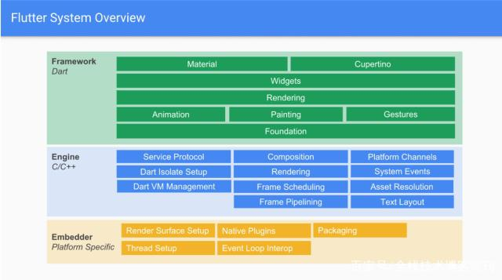
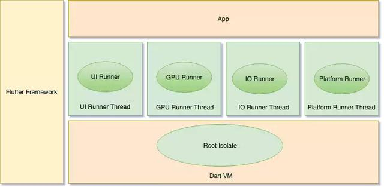
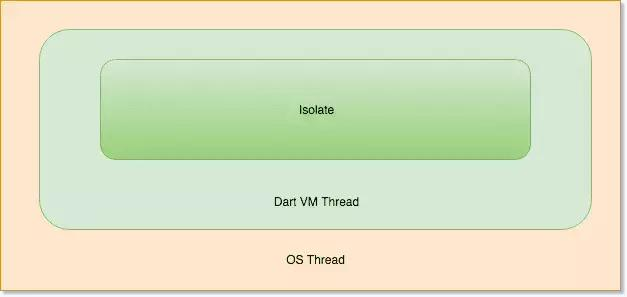

<!--
 * @Author: tangdaoyong
 * @Date: 2021-05-21 11:06:48
 * @LastEditors: tangdaoyong
 * @LastEditTime: 2021-05-21 11:26:16
 * @Description: FLutter Engine
-->
# FLutter Engine

[Flutter Engine线程管理与Dart Isolate机制](https://www.jianshu.com/p/aaa6a8b1d6b0)
[聊一聊Flutter Engine线程管理与Dart Isolate机制](https://blog.csdn.net/alitech2017/article/details/81108487)

在终端业务需求日益复杂，版本迭代日趋于频繁的情况下，我们迫切需要优秀的多端统一跨平台开发方案以提升研发效率。目前已有类似RN，Weex这种通过JavaScript桥接到Native的终端技术方案。但是，基于JavaScript的桥接模式有JavaScriptCore自身的性能瓶颈和桥接层的消耗。

目前闲鱼团队在积极尝试和探索Flutter在业务中的实践以追求更加高效，高性能的跨平台终端方案。同为跨平台技术，Flutter有何优势呢？

Flutter在Rlease模式下直接将Dart编译成本地机器码，避免了代码解释运行的性能消耗。
Dart本身针对高频率循环刷新（如屏幕每秒60帧）在内存层面进行了优化，使得Dart运行时在屏幕绘制实现如鱼得水。
Flutter实现了自己的图形绘制避免了Native桥接。
Flutter在应用层使用Dart进行开发，而支撑它的是用C++开发的引擎。

为了更好地应用和实践，我们需要深入到引擎内部去理解的它的实现原理和构造。线程一直是在开发当中令人比较头疼的话题，我们也在实践过程中踩过不少坑，本文就Flutter引擎的线程模式进行一些探讨。

Flutter 线程管理
Flutter Engine要求Embeder提供四个Task Runner，Embeder指的是将引擎移植到平台的中间层代码。这四个主要的Task Runner包括：

[Flutter Engine线程管理与Dart Isolate机制](https://blog.csdn.net/alitech2017/article/details/8110848)

Platform Task Runner

Flutter Engine的主Task Runner，类似于Android Main Thread或者iOS的Main Thread。但是需要注意他们还是有区别的。

一般来说，一个Flutter应用启动的时候会创建一个Engine实例，Engine创建的时候会创建一个线程供Platform Runner使用。

跟Flutter Engine的所有交互（接口调用）必须在Platform Thread进行，否则可能导致无法预期的异常。这跟iOS UI相关的操作都必须在主线程进行相类似。需要注意的是在Flutter Engine中有很多模块都是非线程安全的。

规则很简单，对于Flutter Engine的接口调用都需保证在Platform Thread进行。

阻塞Platform Thread不会直接导致Flutter应用的卡顿（跟iOS android主线程不同）。尽管如此，也不建议在这个Runner执行繁重的操作，长时间卡住Platform Thread应用有可能会被系统Watchdog强杀。

UI Task Runner Thread（Dart Runner）

UI Task Runner用于执行Dart root isolate代码（isolate我们后面会讲到，姑且先简单理解为Dart VM里面的线程）。Root isolate比较特殊，它绑定了不少Flutter需要的函数方法，以便进行渲染相关操作。对于每一帧，引擎要做的事情有：

Root isolate通知Flutter Engine有帧需要渲染。
Flutter Engine通知平台，需要在下一个vsync的时候得到通知。
平台等待下一个vsync
对创建的对象和Widgets进行Layout并生成一个Layer Tree，这个Tree马上被提交给Flutter Engine。当前阶段没有进行任何光栅化，这个步骤仅是生成了对需要绘制内容的描述。
创建或者更新Tree，这个Tree包含了用于屏幕上显示Widgets的语义信息。这个东西主要用于平台相关的辅助Accessibility元素的配置和渲染。
除了渲染相关逻辑之外Root Isolate还是处理来自Native Plugins的消息，Timers，Microtasks和异步IO等操作。Root Isolate负责创建管理的Layer Tree最终决定绘制到屏幕上的内容。因此这个线程的过载会直接导致卡顿掉帧。

GPU Task Runner

GPU Task Runner主要用于执行设备GPU的指令。UI Task Runner创建的Layer Tree是跨平台的，它不关心到底由谁来完成绘制。GPU Task Runner负责将Layer Tree提供的信息转化为平台可执行的GPU指令。GPU Task Runner同时负责绘制所需要的GPU资源的管理。资源主要包括平台Framebuffer，Surface，Texture和Buffers等。

一般来说UI Runner和GPU Runner跑在不同的线程。GPU Runner会根据目前帧执行的进度去向UI Runner要求下一帧的数据，在任务繁重的时候可能会告诉UI Runner延迟任务。这种调度机制确保GPU Runner不至于过载，同时也避免了UI Runner不必要的消耗。

建议为每一个Engine实例都新建一个专用的GPU Runner线程。

IO Task Runner

前面讨论的几个Runner对于执行流畅度有比较高的要求。Platform Runner过载可能导致系统WatchDog强杀，UI和GPU Runner过载则可能导致Flutter应用的卡顿。但是GPU线程的一些必要操作，例如IO，放到哪里执行呢？答案正是IO Runner。

IO Runner的主要功能是从图片存储（比如磁盘）中读取压缩的图片格式，将图片数据进行处理为GPU Runner的渲染做好准备。IO Runner首先要读取压缩的图片二进制数据（比如PNG，JPEG），将其解压转换成GPU能够处理的格式然后将数据上传到GPU。

获取诸如ui.Image这样的资源只有通过async call去调用，当调用发生的时候Flutter Framework告诉IO Runner进行加载的异步操作。

IO Runner直接决定了图片和其它一些资源加载的延迟间接影响性能。所以建议为IO Runner创建一个专用的线程。

各个平台目前默认Runner线程实现
前面我们提到Engine Runner的线程可以按照实际情况进行配置，各个平台目前有自己的实现策略。

iOS和Android

Mobile平台上面每一个Engine实例启动的时候会为UI，GPU，IO Runner各自创建一个新的线程。所有Engine实例共享同一个Platform Runner和线程。

Fuchsia

每一个Engine实例都为UI，GPU，IO，Platform Runner创建各自新的线程。

## Dart isolate机制

An isolate Dart execution context

isolate定义

isolate是Dart对actor并发模式的实现。运行中的Dart程序由一个或多个actor组成，这些actor也就是Dart概念里面的isolate。isolate是有自己的内存和单线程控制的运行实体。isolate本身的意思是“隔离”，因为isolate之间的内存在逻辑上是隔离的。isolate中的代码是按顺序执行的，任何Dart程序的并发都是运行多个isolate的结果。因为Dart没有共享内存的并发，没有竞争的可能性所以不需要锁，也就不用担心死锁的问题。

isolate之间的通信

由于isolate之间没有共享内存，所以他们之间的通信唯一方式只能是通过Port进行，而且Dart中的消息传递总是异步的。

isolate与普通线程的区别

我们可以看到isolate神似Thread，但实际上两者有本质的区别。操作系统内的线程之间是可以有共享内存的而isolate没有，这是最为关键的区别。

isolate实现简述

我们可以阅读Dart源码里面的isolate.cc文件看看isolate的具体实现。我们可以看到在isolate创建的时候有以下几个主要步骤：

* 初始化isolate数据结构
* 初始化堆内存(Heap)
* 进入新创建的isolate，使用跟isolate一对一的线程运行isolate
* 配置Port
* 配置消息处理机制(Message Handler)
* 配置Debugger，如果有必要的话
* 将isolate注册到全局监控器（Monitor）

我们可以看到Dart本身抽象了isolate和thread，实际上底层还是使用操作系统的提供的OSThread。

### Flutter Engine Runners与Dart Isolate

有朋友看到这里可能会问既然Flutter Engine有自己的Runner，那为何还要Dart的Isolate呢，他们之间又是什么关系呢？

那我们还要从Runner具体的实现说起，Runner是一个抽象概念，我们可以往Runner里面提交任务，任务被Runner放到它所在的线程去执行，这跟iOS GCD的执行队列很像。我们查看iOS Runner的实现实际上里面是一个loop，这个loop就是CFRunloop，在iOS平台上Runner具体实现就是CFRunloop。被提交的任务被放到CFRunloop去执行。

Dart的Isolate是Dart虚拟机自己管理的，Flutter Engine无法直接访问。Root Isolate通过Dart的C++调用能力把UI渲染相关的任务提交到UI Runner执行这样就可以跟Flutter Engine相关模块进行交互，Flutter UI相关的任务也被提交到UI Runner也可以相应的给Isolate一些事件通知，UI Runner同时也处理来自App方面Native Plugin的任务。

所以简单来说Dart isolate跟Flutter Runner是相互独立的，他们通过任务调度机制相互协作。

踩坑血泪史

理解Flutter Engine的原理以及Dart虚拟机的异步实现，让我们避免采坑，更加灵活高效地进行开发。在项目应用过程我们踩过不少坑，在采坑和填坑的过程中不断学习。这里我简单聊其中一个具体的案例：当时我们需要把Native加载好图片数据注册到Engine里面去以便生成Texture渲染，使用完资源我们需要将其移除，看起来非常清晰的逻辑竟然造成了野指针问题。后来排查到注册的时候在一个子线程进行而移除却在Platform线程进行，在弄清楚线程结构以后问题也就迎刃而解。