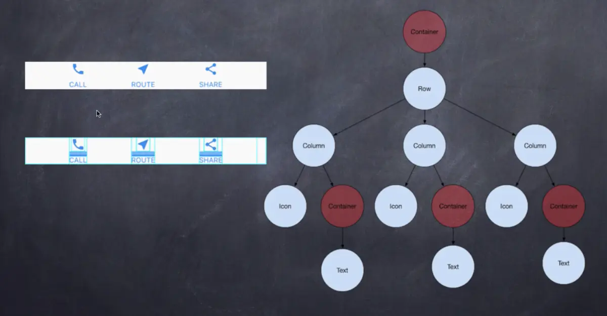

<!--
 * @Author: tangdaoyong
 * @Date: 2021-05-21 11:42:34
 * @LastEditors: tangdaoyong
 * @LastEditTime: 2021-05-21 11:46:50
 * @Description: Flutter widget布局
-->
# Flutter widget布局

widgets可以分为两大类：和Android中的(View&ViewGroup)很像

flutter的布局机制是组件，flutter中几乎一切都是组件，除了图片、文字等，还有用来排列、限制、对齐这些可见组件的行、列、网格等（可理解为系统样式）。

## Single-child layout widgets

单一View，包含Container、padding、Center、Image、Text、Icon; RaisedButton

## Multi-child layout widgets

* Row、Column： 这些具有弹性空间的布局类Widget可让您在水平（Row）和垂直（Column）方向上创建灵活的布局。其设计是基于web开发中的Flexbox布局模型。
* `Stack`： 取代线性布局 (译者语：和Android中的LinearLayout相似)，`Stack`允许子 widget 堆叠， 你可以使用 * `Positioned` 来定位他们相对于Stack的上下左右四条边的位置。Stacks是基于Web开发中的绝度定位（absolute positioning )布局模型设计的。
* GridView将多个widget放在一个可滑动的表格中。
* ListView将多个widget放在一个可滑动的列表中。

Scaffold:Material Design布局结构的基本实现。此类提供了用于显示drawer、snackbar和底部sheet的API。
Appbar一个Material Design应用程序栏，由工具栏和其他可能的widget（如TabBar和FlexibleSpaceBar）组成。
BottomNavigationBar底部导航条，可以很容易地在tap之间切换和浏览顶级视图。
TabBar一个显示水平选项卡的Material Design widget。
TabBarView显示与当前选中的选项卡相对应的页面视图。通常和TabBar一起使用。
MaterialApp一个方便的widget，它封装了应用程序实现Material Design所需要的一些widget。
Drawer从Scaffold边缘水平滑动以显示应用程序中导航链接的Material Design面板。

### 按钮
RaisedButtonMaterial Design中的button， 一个凸起的材质矩形按钮
FloatingActionButton一个圆形图标按钮，它悬停在内容之上，以展示应用程序中的主要动作。FloatingActionButton通常用于Scaffold.floatingActionButton字段。
FlatButton一个扁平的Material按钮
IconButton一个Material图标按钮，点击时会有水波动画
PopupMenuButton当菜单隐藏式，点击或调用onSelected时显示一个弹出式菜单列表
ButtonBar水平排列的按钮组
输入框和选择框

TextField文本输入框
Checkbox复选框，允许用户从一组中选择多个选项。
Radio单选框，允许用户从一组中选择一个选项。
SwitchOn/off 用于切换一个单一状态
Slider滑块，允许用户通过滑动滑块来从一系列值中选择。
Date & Time Pickers日期&时间选择器

### 对话框、Alert、Panel

SimpleDialog简单对话框可以显示附加的提示或操作
AlertDialog一个会中断用户操作的对话款，需要用户确认
BottomSheetBottomSheet是一个从屏幕底部滑起的列表（以显示更多的内容）。你可以调用showBottomSheet()或showModalBottomSheet弹出
ExpansionPanelExpansion panels contain creation flows and allow lightweight editing of an element. The ExpansionPanel widget implements this component.
SnackBar具有可选操作的轻量级消息提示，在屏幕的底部显示。

### 信息展示

Image一个显示图片的widget
IconA Material Design icon.
Chip标签，一个Material widget。 它可以将一个复杂内容实体展现在一个小块中，如联系人。
Tooltip一个文本提示工具，帮助解释一个按钮或其他用户界面，当widget长时间按下时（当用户采取其他适当操作时）显示一个提示标签。
DataTable数据表显示原始数据集。它们通常出现在桌面企业产品中。DataTable Widget实现这个组件
Card一个 Material Design 卡片。拥有一个圆角和阴影
LinearProgressIndicator一个线性进度条，另外还有一个圆形进度条CircularProgressIndicator

### 布局

ListTile:一个固定高度的行，通常包含一些文本，以及一个行前或行尾图标。一个Row中装载最多3行文字；可选则在前面或尾部添加图标。
Stepper一个Material Design 步骤指示器，显示一系列步骤的过程
Divider一个逻辑1像素厚的水平分割线，两边都有填充