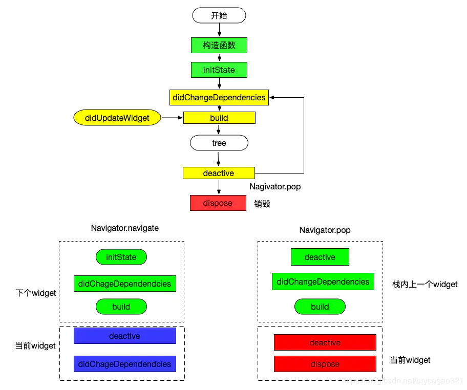

<!--
 * @Author: tangdaoyong
 * @Date: 2021-05-20 17:31:25
 * @LastEditors: tangdaoyong
 * @LastEditTime: 2021-05-20 17:47:57
 * @Description: widget生命周期
-->
# widget生命周期

## 介绍

`Flutter widget`生命周期可以分为3个阶段：

1. 实例化组件并添加到树， 即 `Navigator.push`
2. 状态变化，即打开新的`widget`或者依赖的上级`widget`发生变化。
3. 从树中移除, 即`Navigator.pop`。

## 生命周期

在`Flutter`中`Widget`都是不可变的， 但实际上需要根据对应的状态刷新`Widget`。 从而产生了`StatelessWidget`和`StatefulWdiget`, `StatefulWidget`是由2个对象`Widget`和`State`组成的。将`State`和`Widget`分开是性能， `State`管理状态（可以理解为`Controller`），`Widget`是`UI`（即`View`)。 根据状态变化每次生成`Widget`可以节省内存，即不必每次创建状态对象`State`。

`StatelessWidget`和`StatefulWdiget`的生命周期如下：

| StateLessWidget | StatefulWidget |
| - | - |
| init(构造方法) | Widget-Init(构造方法) |
|  | CreateState() |
|  | State-init |
|  | initState() |
|  | didChangeDependencies() |
|  | didUpdateWidget() |
| build() | State-buid() |
|  | deactivate() |
|  | dispose() |

重点备注几个不是很好理解的方法：

* `initState` 只会在首次创建时触发该方法，而在`rebuild`时并不会触发该方法。
* `didChangeDependencies` `Widget`的依赖关系发生变化时会触发该方法，这个很好理解就是* `Widget`树中父`Widget`发生变化。除此之外还有状态管理也叫数据共享同样会触发该方法.
* `didUpdateWidget` 当父`Widget`发生`setState()`时，父`Widget`并不会发生触发该方法，只会触发子`Widget`的该方法。
* `deactivate` 是`Widget`要从`Widget`树中移除时会触发该方法，在该方法中可以改变`Widget`的依赖关系，避免该`Widget`被销毁.

### 除此之外还有一些和App整体有关的周期方法：

* `resumed App`可见且获取焦点状态
* `inactive App`处于非活动状态
* `paused App`不可见，后台运行状态